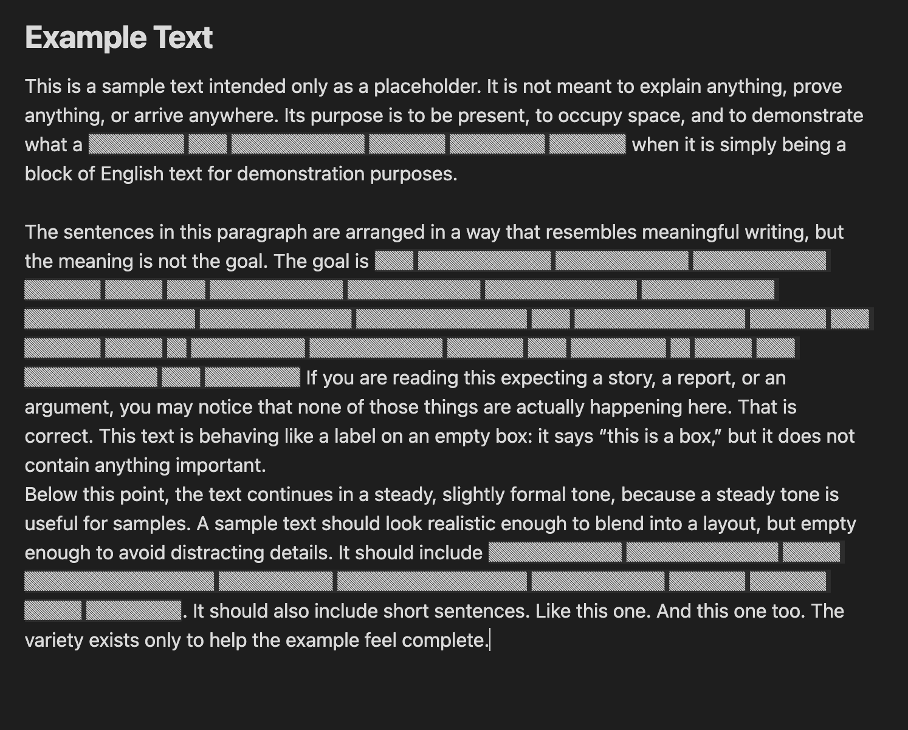
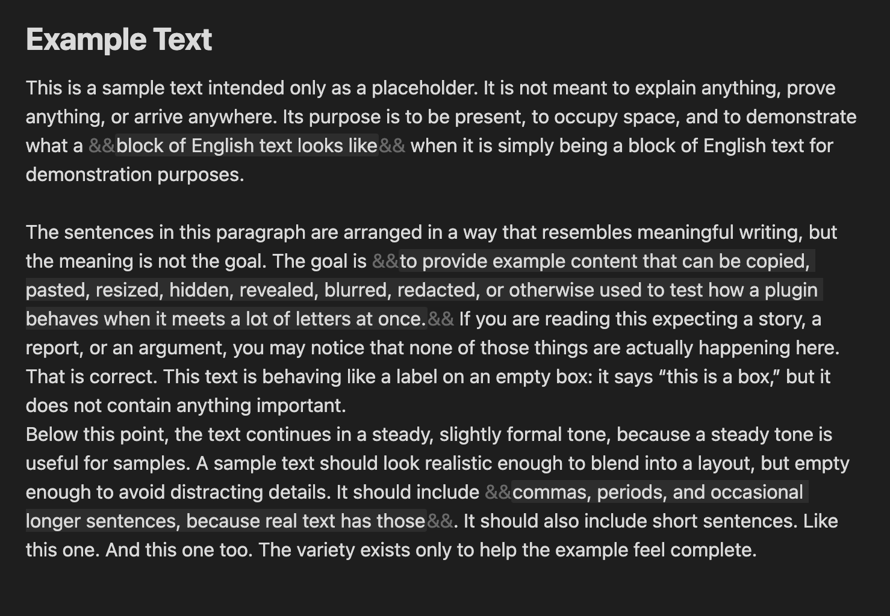

# HideLiner (Obsidian Plugin)

Плагин для Obsidian, который скрывает текст, обернутый в `&&...&&`, и переключает режим отображения одной командой.

## Что делает плагин

- Находит фрагменты вида `&&секретный текст&&`.
- В режиме `Hidden Mode: ON` маскирует содержимое (символы заменяются на `▓`).
- В режиме `Hidden Mode: OFF` показывает исходный текст.
- Работает в preview/live preview (в рамках текущей реализации).

## Пример синтаксиса

```md
Обычный текст.
&&Это будет скрыто в Hidden Mode&&
Снова обычный текст.
```

### Режим скрытия



### Режим показа



## Установка (manual)

1. Склонируйте репозиторий.
2. Скопируйте файлы плагина в папку Obsidian:
   `.obsidian/plugins/hidden-text-toggle/`
3. В Obsidian откройте `Settings -> Community plugins`, включите плагин.

## Команда

- `Toggle Hidden Mode` - переключает режим скрытия/показа.
# HideLiner-Obsidian
